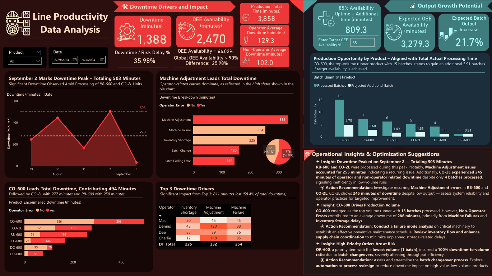
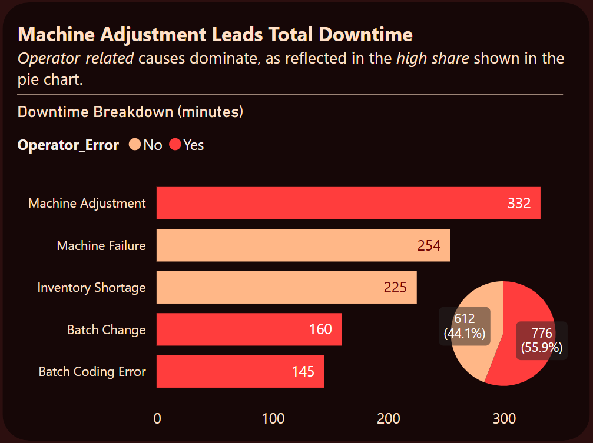
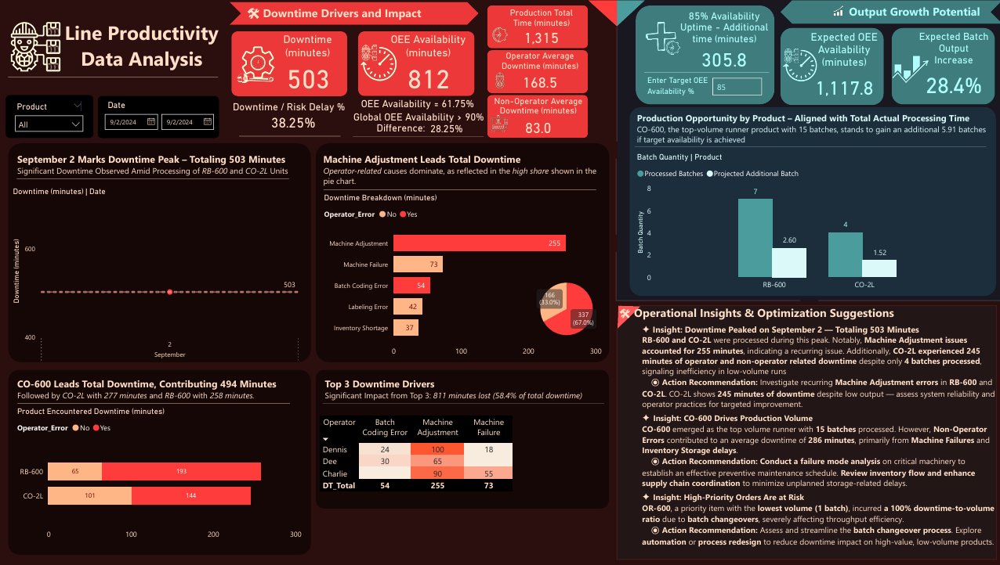
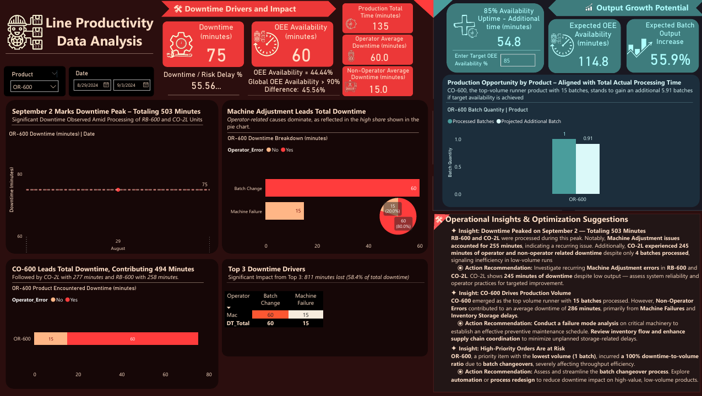

# Line-Productivity---Data-Analysis
Analyzing the Line Productivity and providing a Growth Opportunity based on the Target OEE Availability % 

# Introduction
This project provides a focused analysis of line productivity in the SODA production line, examining data collected over a five-day operational period. The goal is to identify efficiency gaps and uncover growth opportunities by comparing actual performance against industry-standard benchmarks—specifically the Target OEE (Overall Equipment Effectiveness) Availability rate of 85–90%.

The analysis highlights key production trends, major downtime drivers, and machine-specific inefficiencies affecting throughput. Insights are drawn from machine-level batch logs, downtime classifications, and shift-wise activity, with particular attention to high-volume equipment, priority product handling, and critical loss events such as the downtime spike on September 2.

Ultimately, this study aims to support data-driven decision-making for productivity improvement by recommending targeted maintenance, process optimization, and resource alignment strategies.

# Insights Breakdown

### 📉 Lost Output from Low OEE Availability
- Current OEE Availability is at **64%**, far below the target of **85–90%**, indicating a **21–26% productivity gap**.
- Impact: Over the analyzed period, **1,388 minutes** of production time were lost **due to downtime**.
- Example: For **CO-600** (a high-volume product), **494 minutes** were lost—representing **35.6%** of its output potential.

### 📉 Downtime Drivers Suppressing Output
**Downtime Breakdown:**
- **Operator Errors: 56%** (e.g., Machine Adjustments, Setup Errors)
- **Non-Operator Errors: 44%** (e.g., Machine Failures, Inventory Issues)

**Critical Day: On September 2**

- **503 minutes of downtime** were recorded.
- **50.7%** of that was caused by **Machine Adjustments**, while **RB-600** and **CO-2L** were being processed.
- **CO-2L**: Accumulated **245 minutes of total downtime** (both operator and non-operator) despite processing only **4 batches**.

**OR-600 (priority product): Experienced a 100% downtime-to-volume ratio due to inefficient batch changeovers.**

## ✅ Sumamry and Final Recommendation
## ✦ Insight: Downtime Peaked on September 2 — Totaling 503 Minutes
RB-600 and CO-2L were processed during this peak. Notably, Machine Adjustment issues accounted for 255 minutes, indicating a recurring issue. Additionally, CO-2L experienced 245 minutes of operator and non-operator related downtime despite only 4 batches processed, signaling inefficiency in low-volume runs.
- ⦿ Action Recommendation: Investigate recurring Machine Adjustment errors in RB-600 and 	CO-2L. CO-2L shows 245 minutes of downtime despite low output — assess system reliability and operator practices for targeted improvement.

## ✦ Insight: CO-600 Drives Production Volume 
CO-600 emerged as the top volume runner with 15 batches processed. However, Non-Operator Errors contributed to an average downtime of 286 minutes, primarily from Machine Failures and Inventory Storage delays.
- ⦿ Action Recommendation: Conduct a failure mode analysis on critical machinery to establish an effective preventive maintenance schedule. Review inventory flow and enhance supply chain coordination to minimize unplanned storage-related delays.

✦ Insight: High-Priority Orders Are at Risk
OR-600, a priority item with the lowest volume (1 batch), incurred a 100% downtime-to-volume ratio due to batch changeovers, severely affecting throughput efficiency.
- ⦿ Action Recommendation: Assess and streamline the batch changeover process. Explore automation or process redesign to reduce downtime impact on high-value, low-volume products.

